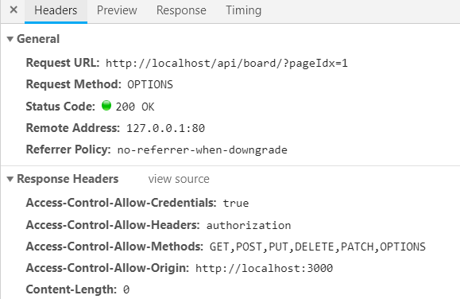

# Spring Board

Spring + react를 사용해서 기초 게시판 제작

# 1 backend
RDBMS + spring + spring security + 외부 로그인 시스템(OAuth 2.0 서드파티 인증 사용. kakao, google, naver)

## 1.1 spring security 주요 설정

```java
@Configuration
@EnableWebSecurity
public class CustomSecurityConfig extends WebSecurityConfigurerAdapter{

    @Autowired
    private CustomTokenFilter customTokenFilter;

    @Override
    protected void configure(HttpSecurity http) throws Exception {
        //...
        http.addFilterBefore(customTokenFilter, UsernamePasswordAuthenticationFilter.class);
        http.cors().configurationSource(request -> getCorsConfigurationSource());
        //...
    }

    @Bean
    CorsConfiguration getCorsConfigurationSource() {
        final List<String> allowedHeaders = Arrays.asList(
                HttpHeaders.ACCESS_CONTROL_ALLOW_HEADERS
                , HttpHeaders.ACCESS_CONTROL_ALLOW_METHODS
                , HttpHeaders.ACCESS_CONTROL_ALLOW_ORIGIN
                , HttpHeaders.ACCESS_CONTROL_REQUEST_HEADERS
                , HttpHeaders.ORIGIN
                , HttpHeaders.CACHE_CONTROL
                , HttpHeaders.CONTENT_TYPE
                , HttpHeaders.AUTHORIZATION);

        final List<String> allowedMethods = Arrays.asList(
                HttpMethod.GET.name()
                , HttpMethod.POST.name()
                , HttpMethod.PUT.name()
                , HttpMethod.DELETE.name()
                , HttpMethod.PATCH.name()
                , HttpMethod.OPTIONS.name()
        );

        CorsConfiguration configuration = new CorsConfiguration();
        configuration.setAllowedOrigins(Arrays.asList("*"));
        configuration.setAllowCredentials(true);
        configuration.setAllowedHeaders(allowedHeaders);
        configuration.setAllowedMethods(allowedMethods);
        //configuration.setMaxAge();

        return configuration;
    }
}
```
일단 요청 url별 인증 & 권한 체크 설정 부분은 생략.

`CustomTokenFilter`클래스는 `OncePerRequestFilter`의 구현체 클래스로 모든 요청이 들어오면 `request`의 헤더를 검사하여

토큰을 추출 & 파싱하여 `SecurityContext`에 올려놓고 다른곳에서 토큰 정보를 자유롭게 사용할 수가 있다. 물론 `OncePerRequestFilter`

에서 토큰의 유효성 검사로 함께 처리해준다.

## 1.2 http 헤더, 메소드 제한(+CORS preflight)

기본적으로 cors 관련 설정들은 상당부분 서버에서 제한된 형태로 만들어진다.

이러한 부분을 상당부분 완화시키고 완화되서 발생할 수 있는 보안 문제는 서버(jwt를 사용함으로써 해결)에서 직접 해결해 준다.

각 설정별 정보
* setAllowedOrigins : cors 제한을 풀어줄 사이트 리스트
* setAllowCredentials : 자격 증명 여부도 함께 수용할 것인지
* setAllowedHeaders : 요청 Header 중 수용할 Header 키값들. 헤더에 괜히 이상한값 넣어서 보내는걸 막는다.
* setAllowedMethods : 허용할 메소드들

여기서 왠만한건 보면 알겠지만 중요한거 몇개를 보면

### 1.2.1 HttpHeaders.AUTHORIZATION

`setAllowedHeaders` 메소드를 사용하여 요청 헤더 내용 중 `Authorization`값을 수용하겠다는 설정. 이 값을 포함 안시키면

아무리 프론트 단에서 헤더에 인증정보(`Authorization`에 값)를 넣어 보내도 서버에서 받아주지를 않는다.

```javascript
    const authToken = cookieUtils.getCookie("Authorization");

    if(authToken){
        option.headers = option.headers || {};
        option.headers.Authorization = 'Bearer ' + authToken;
    }
```

내 소스에서 ajax 요청을 보낼 때 쿠키에서 인증정보를 꺼내서 헤더에다 인증정보를 담아 보내주는 부분인데, 서버에서 헤더값 `AUTHORIZATION`를

받아준다는 설정이 없으면 아무리 이렇게 보내도 서버에서는 받아주질 않는다.

### 1.2.2 HttpMethod.OPTIONS

`setAllowedMethods`를 사용하여 HTTP `OPTIONS` 메소드를 받아주겠다는 의미이다.

다른 메소드들은 Rest API 만들때 자주 사용하니까 넘어가더라도, 위의 메소드 용도는 서버에서 먼저 어떤 메소드 헤더값 등을 수용하는지

먼저 요청을 보낸 후, 요청가능한지 확인 후 최종 요청한다. 설명한 `OPTIONS`메소드로 확인하는 요청을 `pre-flight request`라고 한다.


이 `pre-flight request`은 client(js 소스코드)에서 요청하는게 아니라 브라우저 레벨에서 요청을한다. 만약 모든 ajax 요청에서 

`pre-flight request`가 선행된다면 부담이 가서 `setMaxAge` 메소드를 이용해서 해당 기간 동안 `pre-flight request`을 생략할 수 있다.

chrome의 network 텝을 보면 아래와 같이 확인 할 수가 있다.



# 2 frontend
기존 React로 만든거에서 살짝 수정해서 그냥 사용
* https://github.com/qweasd147/ReactBoard
